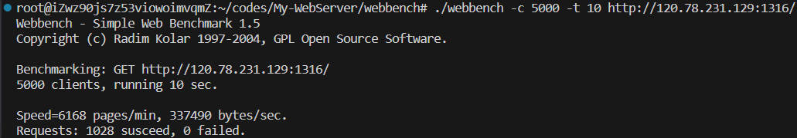

# 压力测试
> 测试环境: Ubuntu 20.04, 配置信息: ecs.e-c1m2.large 2核(vCPU) 4 GiB

```shell
cd ./webbench/
make
./webbench -c 5000 -t 10 http://120.78.231.129:1316/
```


# git 使用
```shell
git clone git@github.com:hualuo321/My-WebServer.git
git status 									// 查询修改状态
git add .									// 想要提交所有的文件
git commit -m "update"						// 为提交的代码添加提交注释
git push -u origing master					// 将代码提交到主分支
git pull origin master						// 拉取远程仓库代码到本地
```

# 常用函数
```cpp
# socket: 创建一个新的套接字 (协议族, 套接字类型, 是否为默认协议) (套接字 fd)
int socket(int domain, int type, int protocol);
int sockfd = socket(AF_INET, SOCK_STREAM, 0);

# setsockopt: 设置套接字选项 (sockfd, 代码级别, 要修改的选项, 缓冲区指针, 缓冲区大小) (操作是否成功)
int setsockopt(int sockfd, int level, int optname, const void *optval, socklen_t optlen);
int ret = setsockopt(listenFd_, SOL_SOCKET, SO_LINGER, &optLinger, sizeof(optLinger));

# epoll_create: 用于创建 epoll 实例 (epoll 可监听 fd 的大小)
int epoll_create(int size);

# epoll_ctl: 向 epoll 实例中添加或删除关注的 fd 
# (epoll 实例 fd, 添加/修改/删除, 待操作的 fd, fd 的事件类型)
int epoll_ctl(int epfd, int op, int fd, struct epoll_event *event);

# epoll_wait: 等待已注册的 fd 上发生事件，并返回发生事件 fd 的数量
int epoll_wait(int epfd, struct epoll_event *events, int maxevents, int timeout);

# close: 关闭一个已经使用的 socket, 并释放其资源
int close(int sockfd);
```

# 常用结构
```cpp
# 存放 socket 中的信息
struct sockaddr_in {
	short	sin_family;						// 协议族, 比如 IPv4(AF_INET)
	u_short	sin_port;						// 端口号
	struct in_addr	sin_addr;				// IP 地址
	char	sin_zero[8];					// 填充字段
};

# epoll 中的事件, 包含事件类型(位掩码实现), 和事件相关的额外信息
struct epoll_event {
    uint32_t     events;					// 可读(EPOLLIN), 可写(EPOLLOUT), 挂起(EPOLLHUP), ET(EPOLLET)
    epoll_data_t data;						// 包含 fd, 指针, int32, int64
};
```
