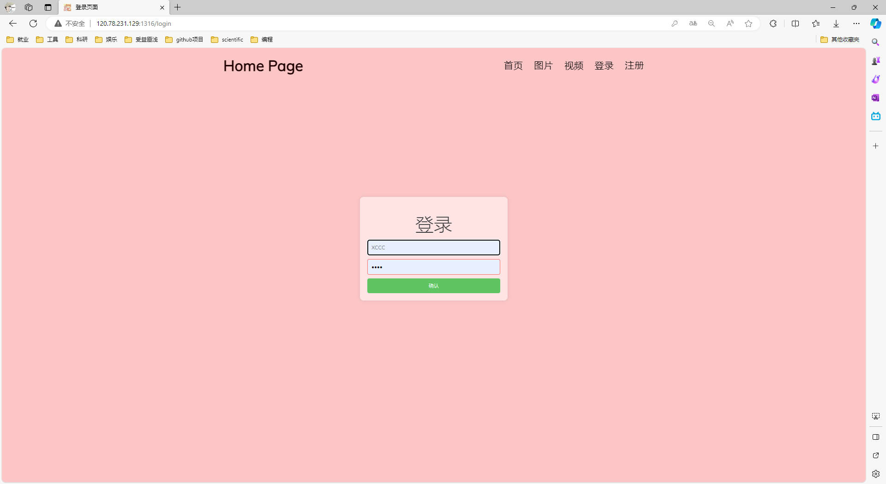

# 项目运行
> 服务端环境: Ubuntu 20.04, 配置信息: ecs.e-c1m2.large 2核(vCPU) 4 GiB
> 
> 客户端环境: Windows10, Edge 浏览器

**确保 MySQL 已安装**
```sql
// 创建数据库
CREATE DATABASE webserver;
USE webserver;

// 创建数据表
CREATE TABLE user(
	username CHAR(50) NULL,
	password CHAR(50) NULL
) ENGINE=InnoDB;

// 插入数据
INSERT INTO user(username, password) VALUES('XAAA', 'YAAA');

// 查看数据表内容
SELECT username, password FROM user;
```
**修改 main.cpp 中数据库初始化信息**
```
WebServer server(1316, 3, 60000, false, 3306, "Mysql用户名", "Mysql密码", "数据库名", 12, 6, true, 1, 1024);
```
**服务端启动**
```
make
./build/run_server
```
**客户端访问**
```
# 浏览器地址栏输入: (服务端的公有 IP: 端口)
http://120.78.231.129:1316/
```

# 页面展示
**首页页面**


**图片页面**


**视频页面**


**登录页面**


**成功页面**


# 压力测试
```shell
cd ./webbench/
make
./webbench -c 5000 -t 10 http://120.78.231.129:1316/
```


# 相关知识
## git 使用
```shell
// 拉取远程仓库
git clone git@github.com:hualuo321/My-WebServer.git
// 查询修改状态
git status
// 想要提交所有的文件
git add .
// 为提交的代码添加提交注释
git commit -m "update"
// 将代码提交到主分支
git push -u origing master
```

## 常用函数
```cpp
# socket: 创建一个新的套接字 (协议族, 套接字类型, 是否为默认协议) (套接字 fd)
int socket(int domain, int type, int protocol);
int sockfd = socket(AF_INET, SOCK_STREAM, 0);

# setsockopt: 设置套接字选项 (sockfd, 代码级别, 要修改的选项, 缓冲区指针, 缓冲区大小) (操作是否成功)
int setsockopt(int sockfd, int level, int optname, const void *optval, socklen_t optlen);
int ret = setsockopt(listenFd_, SOL_SOCKET, SO_LINGER, &optLinger, sizeof(optLinger));

# epoll_create: 用于创建 epoll 实例 (epoll 可监听 fd 的大小)
int epoll_create(int size);

# epoll_ctl: 向 epoll 实例中添加或删除关注的 fd 
# (epoll 实例 fd, 添加/修改/删除, 待操作的 fd, fd 的事件类型)
int epoll_ctl(int epfd, int op, int fd, struct epoll_event *event);

# epoll_wait: 等待已注册的 fd 上发生事件，并返回发生事件 fd 的数量, 如果阻塞 timeout 后没有事件, 则直接返回
int epoll_wait(int epfd, struct epoll_event *events, int maxevents, int timeout);

# close: 关闭一个已经使用的 socket, 并释放其资源
int close(int sockfd);

# read: 从 fd 所对应的文件中读取数据, 放入到缓冲区中
ssize_t read(int fd, void *buf, size_t count);
```

## 常用结构
```cpp
# 存放 socket 中的信息
struct sockaddr_in {
	short	sin_family;						// 协议族, 比如 IPv4(AF_INET)
	u_short	sin_port;						// 端口号
	struct in_addr	sin_addr;				// IP 地址
	char	sin_zero[8];					// 填充字段
};

# epoll 中的事件, 包含事件类型(位掩码实现), 和事件相关的额外信息
struct epoll_event {
    uint32_t     events;					// 可读(EPOLLIN), 可写(EPOLLOUT), 挂起(EPOLLHUP), ET(EPOLLET)
    epoll_data_t data;						// 包含 fd, 指针, int32, int64
};
```

## 常见问题
### 🥂 IO 模型有哪些？
> - 在应用进程进行 IO 系统调用时，内核通常会涉及到两个阶段。第一个是数据准备阶段，此时等待网络数据到达内核。第二个是数据拷贝阶段，将数据从内核拷贝到用户空间。

> - **阻塞 IO**：当应用进程进行 IO 系统调用时，如果内核的数据准备，数据拷贝没有完成，那么进程会一直进行等待。当内核完成数据准备，数据拷贝时，应用进程则会进行相应的读写操作。它的优点是阻塞期间不占用 CPU 资源，但缺点是会占用连接资源。
> - **非阻塞 IO**：当应用进程进行 IO 系统调用时，会每隔一段时间去检查内核的数据准备有无完成。如果数据没有准备好，内核会立即告知应用进程，期间应用程序可以做其他的事情。如果数据准备好了，应用进程会等待内核完成数据拷贝，随后进行读写操作。它的优点是不会占用连接资源，但缺点是轮询查询时比较占用 CPU 资源。
> - **IO 复用**：应用进程使用如 select、poll、epoll 等函数来同时监听多个 fd，如果内核的数据数据没有完成，那么比如像 epoll 会进行等待。当内核数据准备好时，内核会告知哪些 fd 可读写。此时 epoll 会通知工作进程去进行 IO 系统调用，这些工作进程在内核完成数据拷贝后会进行读写操作。它的优点是只需要少量的进程就可以监听大量的连接，非常节省系统的开销。
> - **信号驱动 IO**：应用进程会向内核中注册一个信号处理函数，此时应用进程可以去做别的事情。当内核数据准备好时，会发送信号告知应用程序。随后应用程序会进行 IO 系统调用，等待内核完成数据拷贝后进行相应的读写操作。
> - **异步 IO**：应用进程会调用异步 IO 系统函数，比如 aio_read/write，告知内核用户缓冲区的位置，以及读操作完成后如何通知应用程序。此时应用进程可以去做别的事情。当内核完成数据准备，数据拷贝等操作后，会告知应用程序去进行读写操作。

### 🥂 select，poll，epoll 是什么？
> - select 是将待检测的 fd 放到一个集合中，并将这个集合拷贝到内核中，让内核通过遍历的方式来检查有无事情发生。如果有事件发生，则内核会将相关的 fd 标记，并将 fd 集合拷贝回用户态，用户再次通过遍历的方式找到对应的 fd，调用工作线程去进行读写。

> - poll 和 select 本质上一样，但是存储 fd 信息的结构不同，select 用的是集合，最大fd 个数是 1024，而 poll 用的是链表，理论上没有数量限制。

> - epoll 会在内核中建立一个事件表，并注册待检测的 fd，通过红黑树来管理。每当有一个新的连接时，只需要把新的 fd 添加到内核事件表中。epoll 使用了事件驱动机制，内核中维护了一个就绪列表，如果有事件发生，会通过回调函数让内核把对应 fd 添加到就绪队列并返回。epoll 与其他方法相比减少了 fd 的两次遍历操作，也避免了所有待检测 fd 在用户态和内核态之间的拷贝。 

### 🥂 Reactor，Proactor 是什么？
> - **Reactor**：要求主线程只负责监听 fd 上是否有事件发生，有的话就将 socket 可读写事件放入到请求队列中，交给工作线程来处理。
> - 主线程会往 epoll 内核事件表中注册 socket 上的读就绪事件。
> - 主线程会调用 epoll_wait 等待 socket 上有数据刻可读。
> - 当 socket 上有数据可读时，epoll_wait 会通知主线程，主线程会将 socket 可读事件放入请求队列。
> - 睡眠在请求队列上的某个工作线程会被唤醒，处理可读事件。然后向 epoll 内核事件表中注册 socket 上的写就绪事件。
> - 主线程会调用 socket_wait 等待 socket 上有数据可写。
> - 当 socket 上有数据可写时，epoll_wait 会通知主线程，主线程会将 socket 可写事件放入请求队列。
> - 睡眠在请求队列上的某个工作线程会被唤醒，处理可写事件。

> - **Preactor**：将所有的 IO 操作都交给主线程和内核来处理，工作线程只负责业务处理。
> - 主线程会调用 aio_read 向内核事件表中注册 socket 上的读就绪事件，并告知内核用户读缓冲区的位置，以及读操作完成后如何通知应用程序。
> - 主线程继续处理其它的逻辑。
> - 当 socket 上的数据被读入到用户缓冲区时，内核会向应用程序发送一个信号，通知工作程序有已读数据可进行处理。
> - 应用程序会通过预定义的信号处理函数调用工作线程去进行业务处理。随后工作线程会调用 aio_write 向内核中注册 socket 上的写完成事件，并告知内核用户写缓冲区的位置，以及读操作完成后如何通知应用程序。
> - 主线程继续处理其他的逻辑。
> - 当 socket 上的数据被写入到内核缓冲区时，内核会向应用程序发送一个信号，通知工作程序有已写数据可进行处理，并进行数据的发送。
> - 应用程序会通过预定义的信号处理函数调用工作线程去进行善后工作，比如是否关闭 socket 连接。